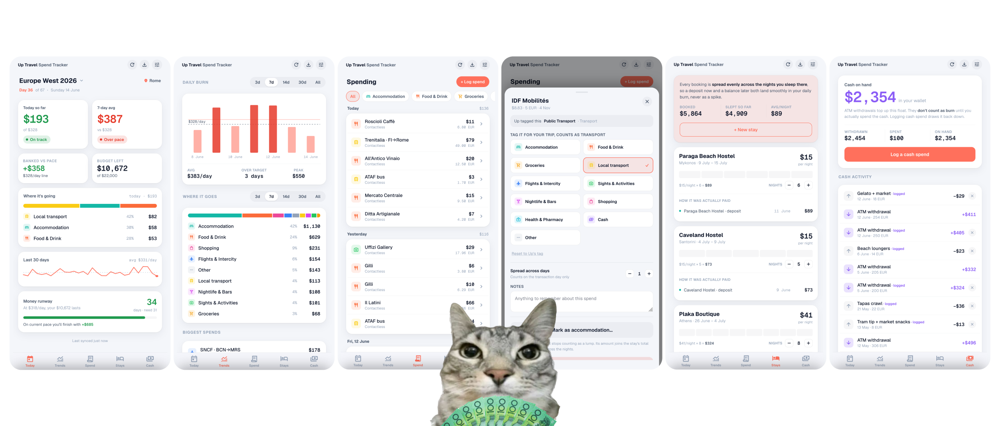

A travel budget tracker that connects to your Up Bank account so you can see at a glance your burn rate and how you're going against your budget. For Up power users and world adventurers :)

Designed for extended trips where spikes in spend makes it a bit harder to track your burn rate. Built with features that I thought would be handy on my 2 month trip. Sure you could spend time on a spreadsheet but this makes it so much easier!

## Deploy

Get your Up Bank Personal Access Token here: https://api.up.com.au/getting_started and keep it safe

Up Bank's [API terms](https://up.com.au/api-acceptable-use-policy/) say each user must use their own personal access token. This app is built around that: you deploy it to your own Cloudflare account!

[](https://deploy.workers.cloudflare.com/?url=https://github.com/kevle1/up-travel)

Sign in to Cloudflare. The platform forks the repo into your GitHub and provisions everything else on your account the Worker, the D1 database, and the KV namespace are all created automatically on the first deploy.

### Open the URL

When the build finishes the dashboard shows your URL (something like `up-travel.your-name.workers.dev`). Open it

You'll land on a Setup screen. Set a password that's how you'll sign in. Paste your Up Bank PAT. Done.

**Note:** Setup is single-shot. If you rotated your PAT click the gear icon top-right, **Reset setup** wipes the password and PAT and starts setup again.

## Features



### Multiple trips

Click the header dropdown to switch between trips.

Each trip keeps its own budget, dates, current city, transactions, stays, cash logs and category overrides. Trip settings lets you edit budget and target, archive. Completed trips are archived for reference.

### Keeping flights out of your pace

One $400 hop reads as a blown day on a $200 target, then drags your 7-day average behind it for a week. Trip settings has a **Keep out of daily pace** toggle for Flights & Intercity.

Switched on, that spend leaves the day chart, the averages, the target comparison and the category breakdown — but **Budget left, runway and your projected finish still account for it**, because the money genuinely went. Your pace reads true and your budget reads true at the same time. The rows stay in Spend, tagged *Off pace* rather than greyed, since they do still count somewhere. Today's Budget left tile shows the off-pace total alongside it so it never goes invisible.

Re-tagging a single transaction into Flights & Intercity moves it off pace too, so a long-distance bus tagged by hand behaves like a booked flight.

### Today View

Glancable dashboard

At the top: how much you've spent today and your 7-day average, each labelled green, amber, or red against your daily target.

Under those, a one-line recap of **yesterday** - what you spent, how far under or over target that landed, and what most of it went on. Early in the day "today so far" is nearly empty, so yesterday is the number that actually tells you how you're travelling.

Below that: how much you're banked (or behind), how much budget is left, where today's spend went by category, a 30-day sparkline, and your **money runway**, how many days your remaining budget lasts at your current pace vs how many days are left in the trip.

When a trip's over, a summary view is shown

### Trends

Daily-burn chart over 3, 7, 14, 30, All days with the target line. Also includes a category breakdown.

Underneath, the **biggest spends across the whole trip** and a quick calc slider that projects how much you'll have at the end if you keep spending at $X/day.

### Spend

I found Up's category for travel was too generic. The app serves every transaction in the trip window, also allowing you to filter by category (mm bier)

Tap any spend - card or hand-logged - to:

- Re-tag from Up's generic category into one of 11 specific ones (Accommodation, Food & Drink, Local Transport, Flights & Intercity, Sights & Activities, Nightlife & Bars, Shopping, Health & Pharmacy, Groceries, Cash, Other).
- **Mark it as accommodation** and link it to a stay (deposits + balance both get amortised across the nights you sleep there, so the hostel booking doesn't spike one day!!).
- **Spread it across N days** for things like N-day transit passes - counts as 1/N each day instead of the full amount on day one.
- **Add notes** that go in your CSV export.
- **Exclude it** from totals (greyed out but still visible so you can re-include later).

Incoming funds (refunds, salary, transfers) show up too, in green with a `+` prefix. They don't affect burn by default, so they're greyed out until you flip **Count as credit** on them — same treatment as an excluded row, because the effect on your totals is the same: none. That toggle is the only control on an incoming row; there's no separate exclude button, since it would just be a second switch for the same thing.

Anything that doesn't move your burn reads as inactive: excluded rows, uncounted incoming funds, and spends dated for a day that hasn't arrived. The day totals above each group follow the same rule, so the header always agrees with the rows under it.

### Log spend

Not everything goes through the Up card. **Log spend** covers the rest: cash, a card Up can't see, a transfer, a bill someone else fronted. Pick the amount, when it happened, what it was for, and how you paid.

The date goes both ways. Today / Yesterday chips for the usual "forgot to log it" case, any earlier date for catching up on the week, and **any day still to come** for something you've booked ahead — a bus ticket bought early, a tour paid up front. An upcoming spend is saved and visible straight away, marked *Upcoming* and greyed out, and starts counting toward your burn on its own day without you touching it again. Dates are held to the trip window, since a row outside it wouldn't appear anywhere.

It saves as a regular transaction, so it's not a second-class row - tap it in Spend and you get the whole editor: re-tag it, spread it across days, **put it under a stay**, add notes, exclude it. Only the ones you logged yourself can be deleted; Up-sourced rows come back on the next sync, so those get excluded instead.

Only the **Cash** method touches your cash on hand. Card and Other are just spend Up never saw.

### Stays

I found it a bit annoying to track how much I spent on accomodation as there was the initial booking deposit, and then payment on arrival. I sometimes extended my stay at hostels too, kinda all over the  place.

Each booking gets its own card with a per-night cost, a row of blocks showing how many nights you've slept, the lumpy real payment schedule, and a stepper to adjust nights. Add a stay manually, link multiple payments to the same one - the app sums them and divides by nights for the smooth amortised cost!

### Cash

Tracks physical cash. Up-sourced ATM withdrawals fill your "cash on hand"; logging a spend as **Cash** draws it back down.

The withdrawn, spent, on-hand triple always reconciles. Spends paid any other way live in the Spend tab and don't touch this view. The float tracks notes in your wallet, so excluding a cash spend from your burn totals still counts it as gone.

## Other cool stuff

- **Sync** runs hourly via a Cloudflare cron and on demand via the **🔄 button** in the top bar. Right-click the button to reset the watermark and pull everything from the trip start. Each spend gets stamped with the city you were in (from the stay covering that day), so it carries through even if stays change later.
- **CSV export** (download icon, top bar) covers every column you'd want: date, description, AUD amount, foreign amount + currency, travel category, Up category, method, city, source (up or manual), accommodation flag + stay nights, excluded, incoming, spread days, payment method, paid-in-cash, notes.
- **Light, dark, auto** theme via the gear menu.
- **No webhooks**, no third-party analytics, no telemetry. Your PAT is a Worker secret, your D1 lives on your Cloudflare account, your transaction descriptions never leave your worker.

## Local development

```bash
pnpm install
pnpm dev
```

- Web on http://localhost:5173 (proxies /api/* to the worker)
- Worker on http://localhost:8787 (local D1 + KV via Miniflare; no Cloudflare account needed)
- Schema is created on the first request - no migration step required
- Open the web URL, run through Setup with any password and your real Up PAT
- Use `pnpm dev:host` if you want to test on your phone over LAN

Hourly cron doesn't fire locally - use the sync button.

## Manual deploy

```bash
pnpm install
pnpm --filter @up-travel/worker deploy
```

Same wrangler config the dashboard uses - provisions D1 + KV in your account on first run. First run prompts you to `wrangler login` if you haven't.

## Privacy

- Password is stored as a PBKDF2 hash in your own Cloudflare KV. Never sent to the browser, never logged.
- Up PAT lives in your KV too - encrypted at rest, only the worker reads it.
- Sessions are signed HTTP-only cookies; the signing key is generated by your worker at Setup and stored in your KV.
- Five wrong passwords from one IP triggers a 15-minute lockout for that IP.
- No third-party analytics or trackers.
- Worker logs (Cloudflare Tail) include sync summaries and error codes; transaction descriptions, amounts, and secrets are never logged.

## Copyright

Unofficial, personal-use project. It is not affiliated with, endorsed by, sponsored by, or connected to Up, Bendigo and Adelaide Bank Limited, or any of their subsidiaries or affiliates

"Up", the Up logo, and all related names, marks, and logos are trademarks of Bendigo and Adelaide Bank Limited.
